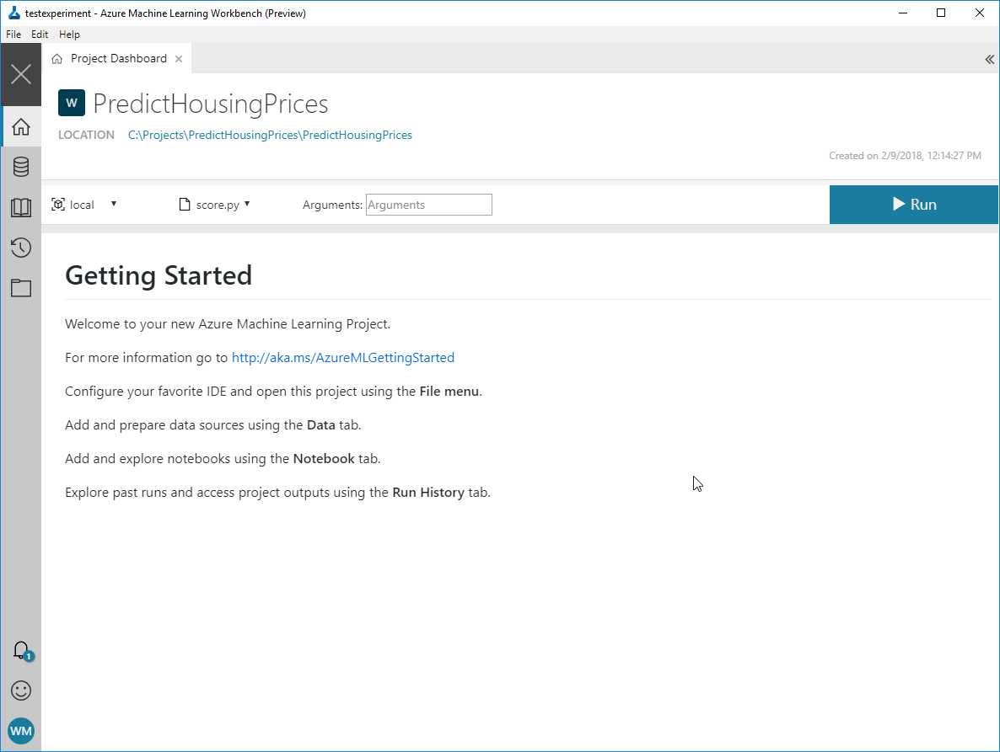
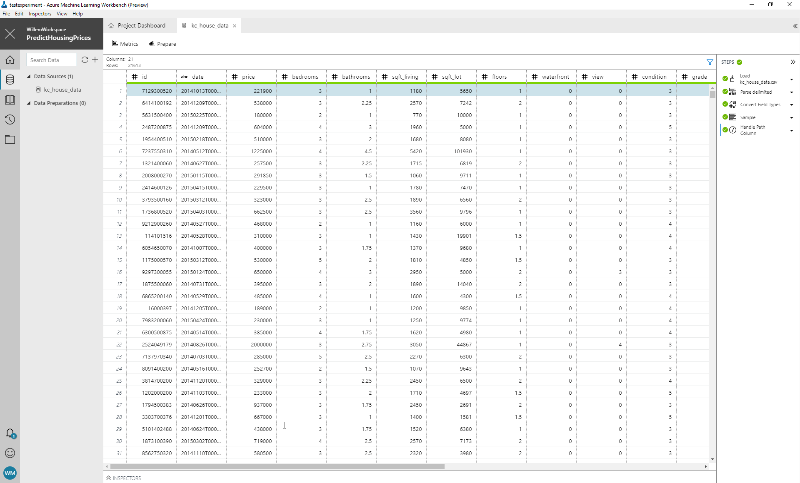
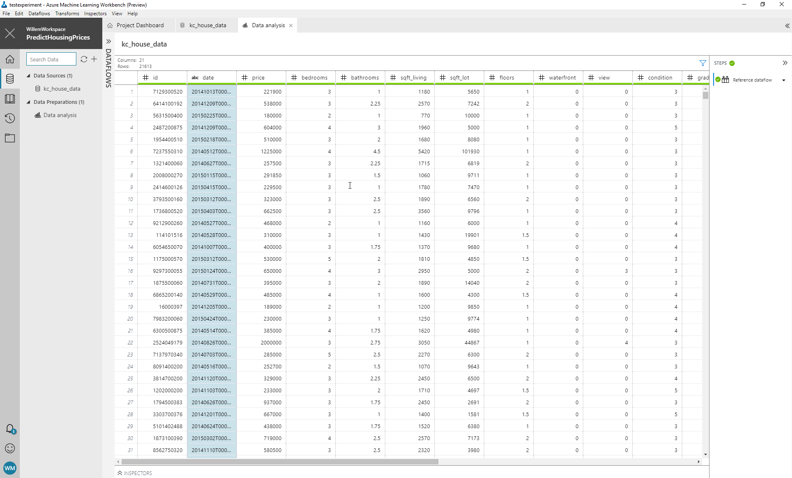

# Challenge 1: Load and prepare the data
For the sake of the challenges in this lab, we're going to pretent you're a 
data scientist for a local real estate agency. 

It is your job to come up with a model that will predict the price that a house 
will sell for in the King County in Washington USA. The agency wants to use
this model in their internal system to come up with the perfect price for each
home they put on the market. 

## The goal of this challenge
You have some data available to you, but no idea how and if you can build a 
model from that to predict the price for a house. 

The purpose of this challenge is to load the initial dataset and clean it up
so we can use it for building a machine learning model.

## Step 1: Create a new project in Azure Machine Learning Workbench
Before you can load data, you need to setup a new project in the Azure Machine
Learning Workbench environment.

With the workbench opened in your Experiment environment, Click the large plus
sign in the list of workspaces. 

Create an empty project with the following properties:

* Name: PredictHousingPrices
* Project path: A folder on your harddrive
* Template: Empty project

Leave the other settings as they are and click create.

**Note** You can attach a Visual Studio online project to your experiment.  
For more information [check the documentation](https://docs.microsoft.com/en-us/azure/machine-learning/preview/using-git-ml-project)

## Step 2: Load the data
Once you've created a new project you will be taken to a screen that displays a 
number of tabs to the left side of the screen.

* Home - This is your project overview. It displays the readme for your project.
* Data - This tab houses the tools to load and prepare data
* Notebooks - This tab provides access to python notebooks for data analysis
* Runs - This tab provides access to information about machine learning jobs
* Files - This tab provides access to files in your project

### Objective: Load the data as a new data source
Navigate to the data tab and add a new data source to your project.
We'll be using the CSV file in the folder `data/kc_house_data.csv` that you
will find in the same folder as this instruction file.

As a data scientist you need to make sure that the file can be properly read.
The add data source dialog provides a number of options for that. 

When you load the CSV file, check the separator and take note of the preview
table at the bottom of the configuration screen. Does it show data in a format
that you would reasonably expect?

Follow the steps in the dialog to finish creating the new data source.
Make sure you use the `Full File` sampling strategy in step 5 of the dialog.

## Step 3: Explore the dataset further
Now that you have the data source linked, let's explore it. 
In Azure Machine Learning Workbench there are a number of interesting metrics
that a data scientist (which you pretend to be today) is interested in.

### Objective: Access dataset quality
Find out the following about the dataset:

* Are there any missing values in the dataset?
* Which columns do you think are promising for building your model?
* Are there any columns that are useless for analysis and should be removed?

**Tip** Hover over the columns to find out more about the values in the column.

### Bonus: Can the date column be fixed in the datasource?
There is a date column in the dataset that doesn't look right. It is marked as
a string, but as you may have noticed it is a date/time encoded in a specific way.

Check the field conversion for the data source and try to find out whether you
can fix the date column so that it becomes a proper date/time.

## Step 4: Clean up the dataset
Now that we have a data source, it is time to prepare a version of the data
for data analysis. 

At the top of the data source screen there's a button `prepare` press it to
make a new data preparation package.

Create a new data preparation package and name it `Data Analysis`. 

The next screen that will open shows you the data preparation package. 
You can now start to clean up the dataset.

### Objective: Remove unwanted columns
We're not really interested in the ID column, because we're trying to figure
out the rules for the price of a house rather than finding a specific home. 

Try remove the column from the dataset in the data preparation package.

**Hint** Right click the columns in the data preparation window!

## Bonus objective: Fix the date column
Remember we tried to parse the date column in the data source. As you may have
noticed, that didn't work.

In a data preparation package however, it is possible to fix the date column.
Although it is not very likely we use the column in our model, it is still worth
while to see if you can fix it.

Figure out how to convert the date column to a proper date/time format.

## Conclusion and next steps
Azure Machine Learning Workbench provides some pretty easy to use tools for
loading data. Imagine doing this in code, I can assure you that it is much 
harder to do the same thing in C# or Python.

Now that you have the data ready for further analysis, let's move on to the
[next challenge](../challenge-2/README.md) for some exploratory data analysis.