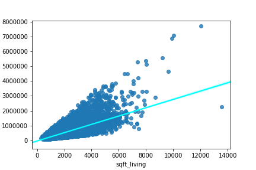
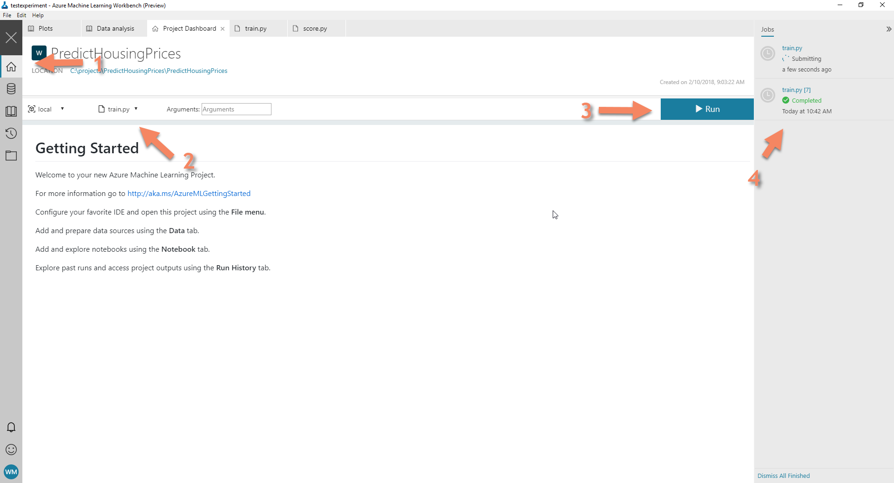
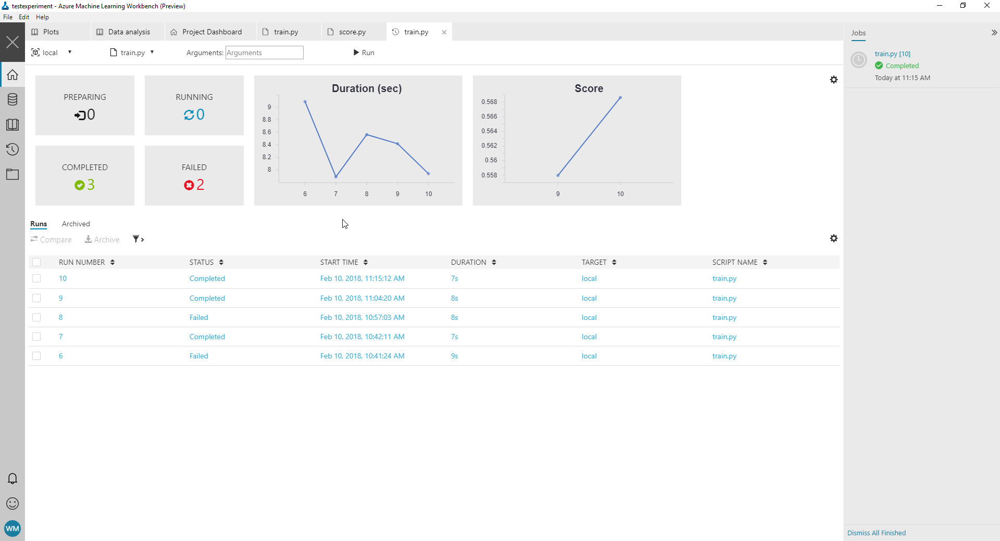

# Challenge 3: Build a model
In the previous challenge you established that a number of features in the 
dataset seem to correlate to the price of a home. This means we can build
a model for it.

In this challenge you're going to build a model based on the findings in the 
previous challenge. Don't worry if you coulnd't quite finish the previous 
challenge. In this challenge I will include all the necessary details so you
can still build the model.

## A little background
The model for predicting a continuous value like the price of a house is called
a regression model. Regression models are models that try to fit a line through
a set of observations so that the line best fits the observations previously 
seen.

Remember, observations are rows in the table of the dataset. Features are the
columns in the table.

As an example, check the plot below. It shows the 
square footage above ground compared to the price those homes were sold for.
The observations are shown as dots. The line in the plot is the regression line
that best fits the observations.



Notice that the model isn't perfect, the difference between 
the line (the prediction) and the actual observations is off by quite a bit.

What does this mean? Clearly using only square footage above ground in the 
regression model isn't enough to predict the price. We need to include 
more features to get a more accurate prediction of the price.

That is what we're going to do in this challenge. We're going to train a linear
regression model based on a number of features to predict the price.

## Prepare your environment
We're now going to code some python code. 
For this you need to have Visual Studio Code. If you haven't done this already,
please make sure that you configure Visual Studio Code as your IDE 
in the workbench.

Check out [the setup guide](../environment-setup,md) for more information.

In [code folder](./starters) you will find a file called `train.py`. Copy this 
file to the root of your workbench project. It contains a number of imports 
and other useful things that you need in this challenge.

## Step 1: Prepare the data for training
Remember what I explained in the [second challenge](../challenge-2/README.md) 
about outliers and their influence on the parameters of a machine 
learning model?

There's yet another challenge with machine learning models. Remember that we
talked about the fact that machine learning tries to learn the average of 
the observations.

By learning the average we are capable of predicting the price of homes that 
we used for training the model really well. Because the model actually remembers
seeing the sample before.

But what happens when you show it an example that it hasn't seen before? Yup, it
doesn't quite know what to do with it. When all goes well however, the model
learned the general rules for house prices well enough so that it can come up
with a good enough prediction of the price of the house it hasn't seen before.

This effect is called overfitting and it is a real nightmare when it happens
to your model, because it is essentially rubbish.

Sounds interesting, now how are we going to make sure that the model 
actually learns the general rules for housing prices instead of just 
remembering data? 

You need to validate the model against a set of observations that it didn't 
learn from. But we don't have those just yet, so we need to perform a 
little trick.

We're going to set aside a set of observations to later validate 
the model against. To do this we need to use the function `train_test_split`
from the package `sklearn.model_selection` here's how to use it:

```
from sklearn.model_selection import train_test_split

df_train, df_validation = train_test_split(df, test_size=0.2)
```

### Objective: Build a training and validation set
Click the menu item `File > Open project (Visual Studio Code)` to open the 
project in Visual Studio Code so you can edit the python code.

Open up the file `train.py`, notice that it already contains a number of import
statements and some boilerplate to integrate the python code with the Azure 
Machine Learning Workbench environment.

The package import for the test/train split function is already imported, as
is the dataset that you need for this challenge.

Now it is your turn to split the dataset into a training and validation set.

## Step 2: Train the model on the trainingset
Now that you have a training and validation dataset, let's build the actual
model. We're going to use the `LinearRegression` class 
from the `sklearn.linear_model` package.

The class can be used like this:

```
feature_names = ['sqft_above', 'sqft_basement', 'grade', 'condition']

features = df_train[feature_names].values
y = df_train[['price']]

model = LinearRegression()
model.fit(features, y)
```

We're going to train the model on four features: `sqft_above`, `sqft_basement`,
`grade` and `condition`. 

We extract these from the trainingset into an array. We do the same for price.

Finally we create a `LinearRegression` model instance and fit it on the data.

### Objective: Train the model
Add the necessary code to the train.py file using the sample above and save the
file. Be sure to name the variable for your model `model`!

Run the code by following these steps:

 * Go back to the workbench application
 * Select the home tab on the left side of the screen
 * Select `train.py` from the dropdown list
 * Click the `run` button

A new item in the runs panel will be added. Click it and explore the log files
and results in the details window.



### Objective: Store the model
Currently the job doesn't output anything. We do train the model, but we don't
save it for use later on. That's kind of counter-productive. So let's save the
model on disk before we move on.

In python you can save objects to disk using the pickle module. 
To store an object you can use the code below:

```
import pickle


with open('./outputs/model.pkl', 'wb') as model_file:
    pickle.dump(model, model_file)
```

To save the file, include the pickling code after the code that creates the 
output folder. This ensures that the model can be indeed stored in the 
output folder.

**Note** I have already included the pickle package in the script. You only
need the code to open the output file and pickle the object to the file.

## Step 3: Validate the model
We have a trained model that we can later use to predict prices. But we don't 
know how good the model is.

To find out we need to validate the model. Remember the validation set that we
created earlier? We are going to need it for this step.

We're going to validate our model using [the R^2 (R squared) metric](https://en.wikipedia.org/wiki/Coefficient_of_determination). 
This is a metric that measures how well the line that we fitted matches 
a set of observations. 

A value of 1.0 is perfect, a value of 0.0 or lower is really bad. Learn more on
how to interpret this score [in this blogpost](http://blog.minitab.com/blog/adventures-in-statistics-2/regression-analysis-how-do-i-interpret-r-squared-and-assess-the-goodness-of-fit)

To score the model we have to add a extra piece of code below the training step
inside `train.py`:


```
validation_features = df_validation[feature_names].values
validation_y = df_validation[['price']].values

score = model.score(validation_features, validation_y)

logger.log('Score', score)
```

First we extract the features from the validation set using the same technique
as before to create arrays. Next we score the model using these features.

Finally we log the metric using the Azure ML logger. This step writes the score
to the workbench application so we can see the metric.



As you can see in the image above, logging the metrics is useful. 
Because it enables you to compare the changes in score over time in the 
workbench application. 

### Objective: Validate your model
Use the code in the sample above to add validation logic to your model.
Be sure to use the same feature names for training and validation.

Run the job again to check the score of your model. Does it look like this
model does an accurate prediction (Remember, we want a score as close to 
1.0 as possible).

### Objective: Improve your model
It seems as if we didn't fully explain the price of a house by its features.
Try to include other features such as `bedrooms` and `bathrooms` and see if 
the score improves. 

If you want you can go to your data analytics notebook and explore the data some
more to find out what other features could be useful.

**Hint** I personally feel that the size of the lot and features about 
the location such as the fact that we have a waterfront and a good view
are quite important. Maybe those provide the explanation of a higher price?

## Next steps
Now that we have made a model and optimized it a bit, we need to look at how
to use the model in production. Go to 
[the next challenge](../challenge-4/README.md) and find out!

