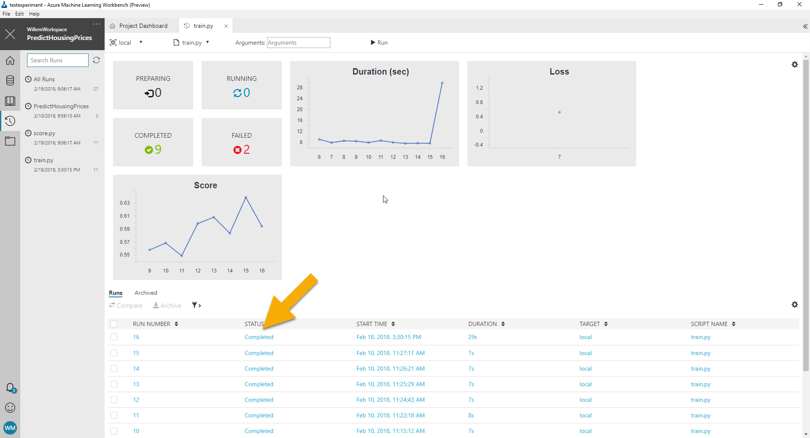
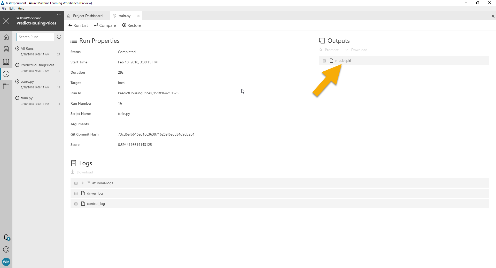
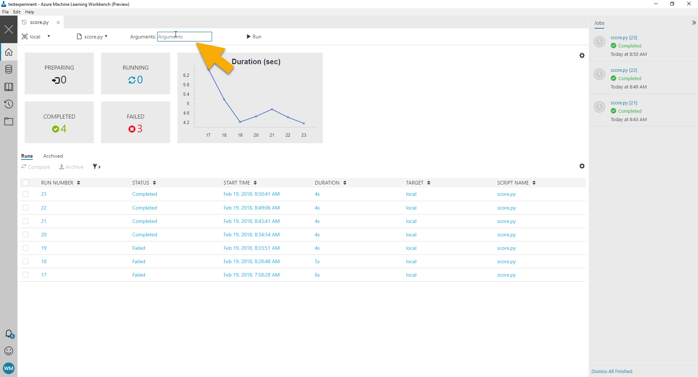

# Challenge 4: Deploy your model to Azure
The first three challenges helped you build a model from the dataset. In this 
challenge we're going to build some components to use the model and then deploy
it to a production cluster.

## Preparation
Azure ML workbench exposes models as services through the use of `score.py`.
This file has a specific structure that you need to adhere to.

To help you get started, I went ahead and made the structure for you.

In the [starters](starters/) folder you'll find a `score.py` file. Copy
this to the root of your project.

## Step 1: Build the service for your model
In order to use a model in production we need to write some code to host the 
model. So let's do that first.

### Using the model from the previous excersise
In the previous exercise we created a model by running `train.py`. When you
go to the run history tab in Azure ML workbench and open up the run details
of `train.py` you will find that the model is visible as an asset.




### Objective: Promote the model
In order to use the model in your scripts, promote it in the user interface
of the ML workbench. Mark the checkbox in front of the model asset and 
click promote it.

### The init function
Take a look at the `init` function in `score.py`. Azure ML will use it 
to intialize the service.

Typically you initialize global variables used in your service in this function.

For example, take a look at the code below:

``` python
global_var = None

def init():
    global global_var

    global_var = 42
```

This code first defines the `global_var` variable at the start of the script.
Then we define the `init` function and mention that `global_var` is a global
variable in the script using the `global` keyword. Then we assign the value.

Now when you use the `global_var` variable after you executed `init` it will 
have the value 42. Without the global statement there would be a second 
`global_var` in the function that has a different value than the globally 
defined one.

### Objective: Load the model from disk
In the `init` method we need to load the model to the global model variable.
Complete this method by using the `pickle.load` method to load
the model from disk.

A sample of how to use the `load` method from the `pickle` module is shown below.

```
with open('some_file.pkl', 'rb') as input_file:
    model = pickle.load(input_file)
```

Now it's your turn. In the `init` I've included some code to locate the file
for your model in disk. It's your job to load it using the pickle module.

### The run function
With the init function completed, let's move on to the `run` function. 
This function is used for making predictions with your model.

In our case, we need to take the input from the user, put it through our model
and obtain a prediction. 

The run function accepts the input from the user. You can provide data frames,
arrays or single values to the run function. The data that is accepted is defined
by a schema that we generate later on in this excersise.

### Objective: Predict the price of a house
Modify the run method so it accepts a single argument called data. 
Remember we used Pandas to load data from disk in challenge 2. We're going to
use it again for the incoming data.

It is not clear right now that the incoming data is an incoming pandas 
dataframe. This comes from the fact that Python doesn't have types in the 
traditional sense.

I'm telling you we're using pandas as a hint on how to handle the incoming data.
Don't worry if you don't know the Pandas API. I'll help out with the details.

The `run` function has a signature like this:

``` python
def run(data):
    ...
```

Modify the function to make a prediction with your model. 
For this you need to invoke the  `predict` method on your model. 
In my case it looks like this:

``` python
result = model.predict(some_data)
```

The data we're going to provide to this function comes from the data argument.
This is a pandas dataframe. You can provide it directly to the predict function.

The output will be a numpy array. In order to return it to the caller you need
to convert it first to a list and then to json using this code:

``` python
import json

return json.dumps(result.tolist())
```

Complete the `run` function and test it by running the `score.py` file from
the home tab in the Azure ML workbench application. Check the output for
the prediction.

## Step 2: Publish the service on Azure
When the script is finished you will have a working
scoring script. Now it is time to deploy it to Azure as a service.

If you haven't done so already, make sure that you have an 
[environment setup for this step](../environment-setup.md).

Publishing your service to Azure involves two steps:

 1. Create a schema for the service
 2. Publish the service to Azure

### The schema
Azure machine learning services combine the model, scoring script and a schema
into a single REST API. We have the model and the scoring script, but we don't
have a valid schema yet.

Since Python is dynamically typed we can't really tell which types our inputs
should have using code alone. We actually have to execute the code to obtain
the type information.

In the `score.py` file there's a function called `generate_api_schema`. 
This method gets invoked automatically when you run `score.py --generate`. 

The `generate_api_schema` function is responsible for generating a description
of your service so that Azure ML can deploy it in the cloud and use it 
correctly.

### Objective: Publish a schema
Before running the generate schema operation, you need to make sure that the 
correct features for your model are included in the sample request.

Check the `generate_api_schema` function and make sure that it includes the 
features that you use in your model.

Done? Run the `score.py` file from Azure ML workbench. Make sure that you 
provide `--generate` as a commandline argument.



### Publishing the service
In order for you to use your model in production you need to do a number of things:

 1. Publish one or more models
 2. Publish a manifest that links the models and scoring script together
 3. Publish an image based on the manifest 
 4. Deploy the image on your production cluster

That's alot of steps to take care of. You are in luck though, the Azure CLI
can all of these steps into a single command.

### Objective: Publish the service
In the previous objective you generated a JSON schema for your service. 
The run details for `score.py` contains an asset `schema.json`. Download this
asset to the root of your project.


You also need to download you model. This works similar to downloading the schema.
Navigate to the run history of train.py and grab the latest trained model there.

Now that you have a schema and model, let's publish the service on Azure. For this you
need to open up the command terminal in Azure ML Workbench.

Click `File -> Open command prompt`. This opens up a command prompt.

Execute the following command:

```
az ml service create realtime -m model.pkl -d assets -f score.py -c aml_config\conda_dependencies.yml -r python -s schema.json -n predicthousingprices
```

The parameters for this command are:

 * -m: The model that we want to use (model.pkl)
 * -d: The additional dependencies that we want to use (the assets folder)
 * -f: The scoring script (score.py)
 * -c: The runtime dependencies file for our image (aml_config\conda_dependencies.yml)
 * -r: The runtime we want (python)
 * -s: The schema for our service
 * -n: The name of the service

The commandline utility may raise the following error:

``` json
{
    "Azure-cli-ml Version": "0.1.0a27.post3",
    "Error": "Model Management Account not set. Please run 'az ml account modelmanagement set'"
}
```

To fix the problem you need to bind the modelmanagement account to your experiment.
Use the following command in the command prompt to bind it:

```
az ml account modelmanagement set -n <account-name> -g <resource-group-name>
```

This command requires the resource group name (-g) and the account name (-n)

**Note** You can find the name for your model management account in the Azure Portal
in the resource group for the experimentation environment you created at the start of this workshop.

### Objective: Try out your service
When the service is published you can start to use it. After you've executed the
create service command you will get some helpful information about linking to your service.

Follow the instructions in your terminal window and try to use the service from
your favorite programming language!

## You're done!
Looks like you made it! Your first machine learning model in production. Time to make some money
in the housing market.

Interested in more learning? Check out these helpful links for more information:

* [Azure ML workbench documentation](https://docs.microsoft.com/en-gb/azure/machine-learning/preview/)
* [More information about Scikit-learn](http://scikit-learn.org/stable/)
* [More information about jupyter notebooks](http://jupyter.org/)
* [Azure data architecture guide](https://docs.microsoft.com/en-us/azure/architecture/data-guide/)