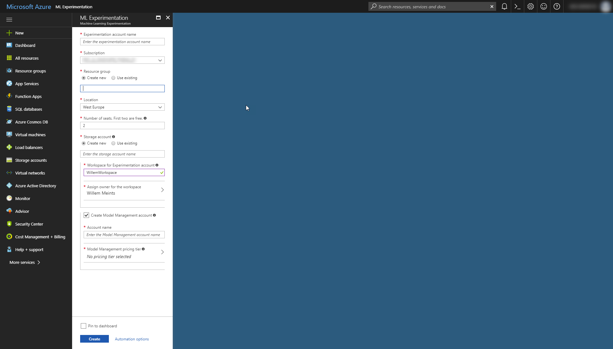
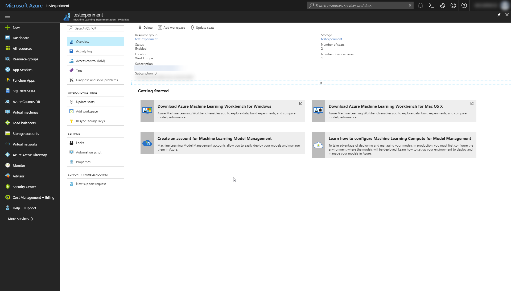
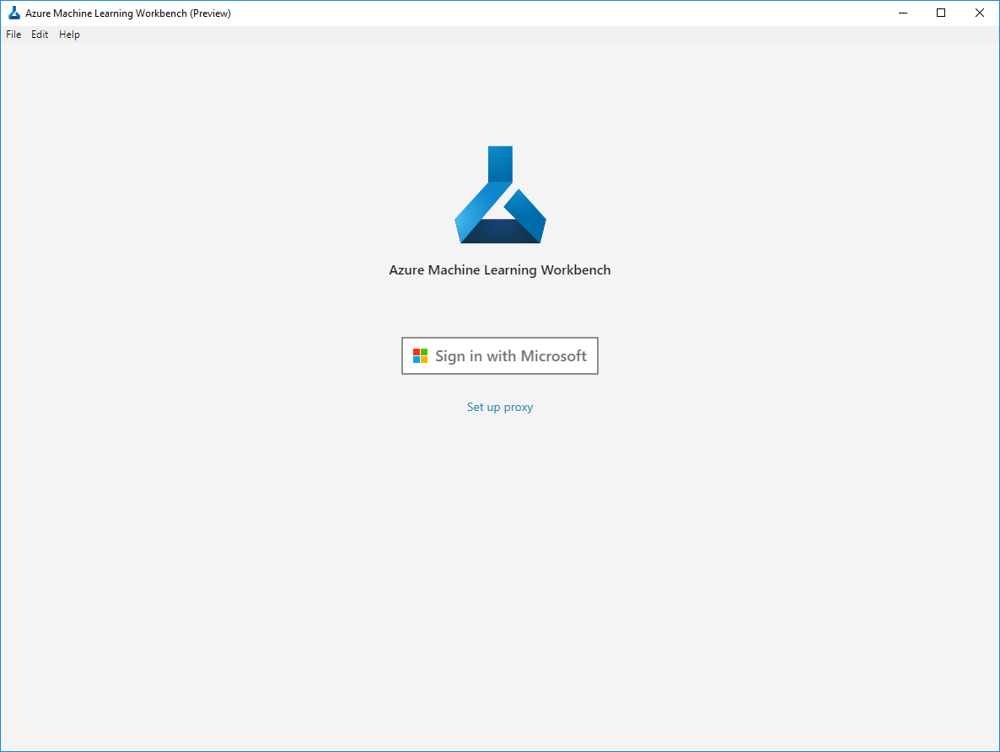
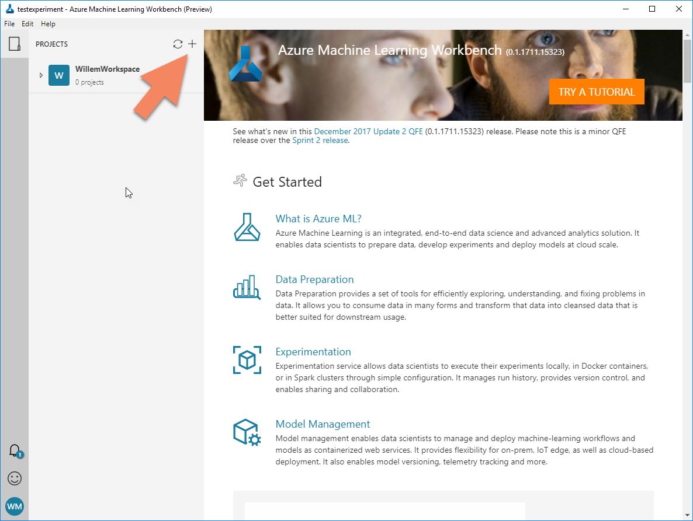

# Environment setup instructions
For the challenges you will be using Azure Machine Learning Workbench.
Follow these instructions to create an Azure Machine Learning Experimentation 
environment and install the Azure Machine Learning Workbench.

## Step 1: Create an Azure Machine Learning Experimentation environment
Open up the azure portal and search for `machine learning`. A list of possible 
resources shows up, among them the `Azure Machine Learning Experimentation` 
resource.


Select the experimentation resource type and click the `Create` button.

**Quick link**: [Open the create experiment dialog](http://bit.ly/2ERn12j)

## Step 2: Specify the details for your experimentation environment
You'll now see a screen that allows you to specify the properties of your 
environment.



Specify the following properties:

 * The name of the experiment
 * A storage account for the experiment
 * The name of the experiment workspace
 * A model management account

 **Note** Please specify the dev/test pricing tier for the model 
 management account. This is a free option that will ultimately save you
 a lot of money.

Now click the create button and grab something to drink. It will take a few
minutes for the resources to be created. 

 ## Step 3: Download the tools
 Once you have confirmation that the deployment is done, navigate to the 
 experiment you just created. 

 

 The page you'll see is a quickstart for the Azure Machine Learning experiment.
 It contains links to the tools that will help you build your experiment.

 Click the download link for the Azure Machine Learning Workbench tool for the
 platform of your choice. 

 **Note** As of the moment of writing only Mac and Windows are supported.

 ## Step 4: Install the tools
 After you downloaded the tool, start the installation and follow the 
 instructions to install the Azure Machine Learning Workbench on your machine.

 Once installed, open the Azure Machine Learning Workbench. Login with your
 microsoft account and select the experiment that you've just created.

 

## Step 5: Create a new project in Azure Machine Learning Workbench
Before you can load data, you need to setup a new project in the Azure Machine
Learning Workbench environment.



With the workbench opened in your Experiment environment, Click the large plus
sign in the list of workspaces. 

Create an empty project with the following properties:

* Name: PredictHousingPrices
* Project path: A folder on your harddrive
* Template: Empty project

Leave the other settings as they are and click create.

**Note** You can attach a Visual Studio online project to your experiment.  
For more information [check the documentation](https://docs.microsoft.com/en-us/azure/machine-learning/preview/using-git-ml-project)

## Step 7: Install Visual Studio Code and configure it as your IDE
Click the `File > Configure Project IDE` to configure the IDE for your project.
Enter the following properties:

 * IDE Name: Visual Studio Code
 * Path for the IDE: C:\Program Files\microsoft VS Code\Code.exe

Save the changes and close the panel.

## Step 8: Create a production environment
If you're planning on deploying your model to Azure in [Challenge 4](challenge-4/README.md) then you
need to setup an Azure ML environment. Go to `File -> Open command prompt` and 
execute the following command in your command prompt:

```
az ml env setup -l eastus2 -n testexperimentenv
```

This creates a new VM with docker for Azure ML experiments in the region eastus2.

**Note** I used eastus2 because this service is in preview and currently doesn't
work in westeurope or other regions. 

Bind the environment to your experiment using the following command:

```
az ml env set -g testexperimentenvrg -n testexperimentenv
```

## Ready? Start your first challenge
You now have a fully configured machine learning environment.
Now you're ready to get started with [Challenge 1](challenge-1/README.md).